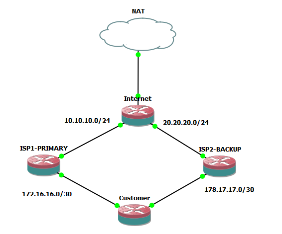

# Dual ISP Failover Using MikroTik

## Overview

Designed and implemented a dual ISP failover solution using MikroTik RouterOS in GNS3.

## Objective

Provide internet redundancy for a business customer using:

- ISP1 (Primary)
- ISP2 (Backup)

## Technologies

- MikroTik RouterOS
- GNS3
- DHCP
- NAT
- Recursive Routing
- Failover

## Topology

## Testing

- Verified internet connectivity through ISP1
- Simulated ISP1 failure
- Verified automatic failover to ISP2
- Verified automatic failback when ISP1 recovered

## Skills Demonstrated

- High Availability
- Network Redundancy
- Recursive Routing
- WAN Failover
- Network Troubleshooting
